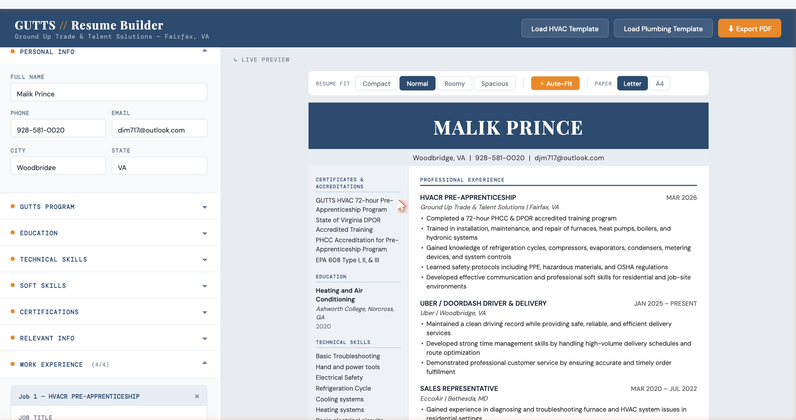

# GUTTS Resume Builder

**A free, browser-based resume builder built specifically for [Ground Up Trade & Talent Solutions (GUTTS)](https://gutts.tech) pre-apprenticeship graduates in the skilled trades.**

---

## What It Does

GUTTS students complete intensive 72-hour pre-apprenticeship programs in HVAC or Plumbing — and they deserve a resume that reflects that. This tool makes it dead simple to build a clean, professional, one-page resume in minutes, right in the browser. No accounts, no subscriptions, no installs.

---

## Features

- **Live preview** — see your resume update in real time as you type
- **HVAC & Plumbing templates** — one-click pre-fill with GUTTS program credentials, certifications, and accreditations
- **Resume Fit controls** — Compact / Normal / Roomy / Spacious presets to dial in spacing
- **Auto-Fit** — automatically picks the best layout based on how much content you have
- **A4 & US Letter** — toggle paper size before exporting
- **Export to PDF** — prints clean with full background colors, no UI chrome
- **Smart validations** — phone formatting, email check, overflow warnings, skill/job limits to keep everything on one page
- **Zero dependencies** — single HTML file, works offline, open in any modern browser

---

## How to Use

1. Open the app (hosted link or just open `GUTTS_Resume_Builder.html` in Chrome)
2. Click **Load HVAC Template** or **Load Plumbing Template** to pre-fill your GUTTS credentials
3. Fill in your personal info, education, skills, and work experience
4. Use **Auto-Fit** or the preset buttons to adjust spacing if needed
5. Click **Export PDF** — done

---

## Tech Stack

- Pure HTML / CSS / JavaScript — no frameworks, no build step
- Single file (`GUTTS_Resume_Builder.html`) — deploy anywhere as a static site
- CSS custom properties for live typography/spacing control
- `@media print` + `print-color-adjust: exact` for accurate PDF output

---

## Hosting

Deployed as a static site on [Render](https://render.com). No server required.

---

## About GUTTS

Ground Up Trade & Talent Solutions is a DPOR-accredited pre-apprenticeship program based in Fairfax, VA, preparing students for careers in HVAC, plumbing, and the skilled trades.

Learn more at [gutts.tech](https://gutts.tech)

---

Built by the GUTTS team.
